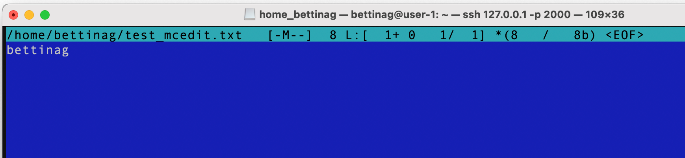
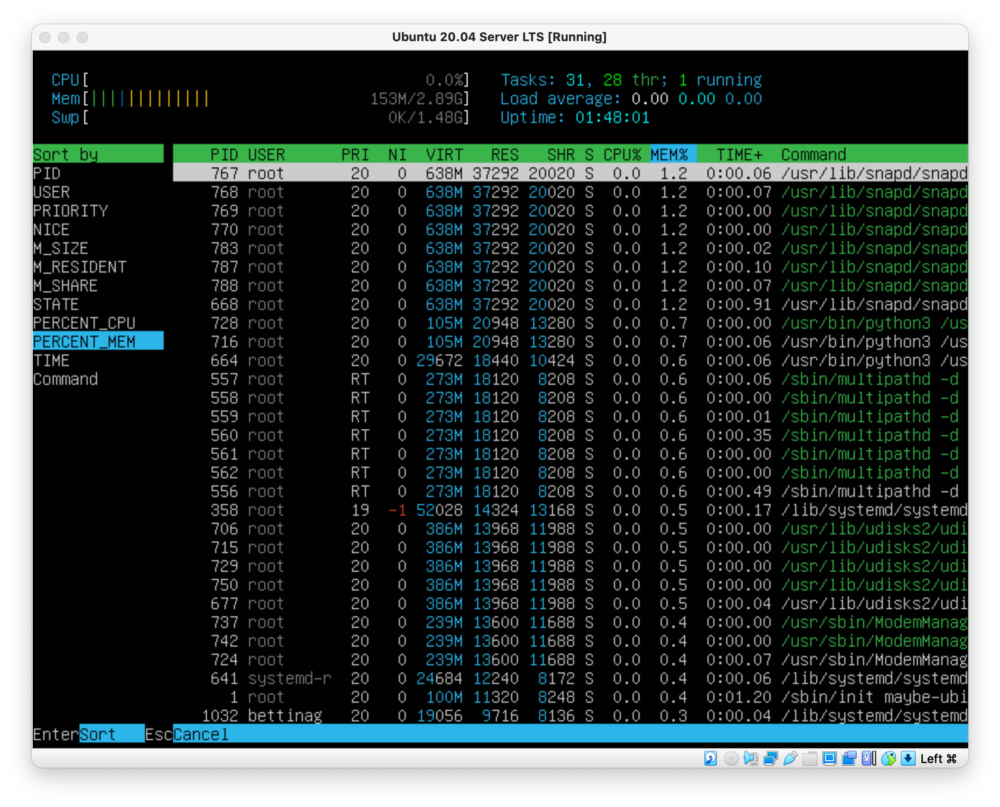

# UNIX/Linux operating systems (Basic).

## Part 1. Installation of the OS

- Install Ubuntu 20.04 Server LTS without GUI. (Use VirtualBox)

  

## Part 2. Creating a user

- Add a screenshot of command call to create user.

  

- The new user must be in the output of the command:
  cat /etc/passwd
- Add a screenshot of the command output.

  

## Part 3. Setting up the OS network

- Set the machine name as user-1

  

- Set the time zone corresponding to your current location.

  

- Output the names of the network interfaces using a console command.

  In the report give an explanation for the presence of the lo interface.

  > lo interface is a virtual network card with address localhost (127.0.0.1). The loopback device is a special, virtual network interface that your computer uses to communicate with itself. It is used mainly for diagnostics and troubleshooting, and to connect to servers running on the local machine

  

- Use the console command to get the ip address of the device you are working on from the DHCP server: 10.0.2.15

  

  > DHCP ( Dynamic Host Configuration Protocol - dynamic host configuration protocol ) is a network protocol that allows network devices to automatically obtain an IP address and other parameters necessary to operate on a TCP / IP network .

- Getting an external ip address: 195.133.239.85

  

- Getting the internal ip address using ip route: 10.0.2.2

  

- Set static (manually set, not received from DHCP server) ip, gw, dns settings (use public DNS servers, e.g. 1.1.1.1 or 8.8.8.8).

  

- Describe in the report what you have done to complete all seven points (you can do it in text or with screenshots).
- Successfully ping 1.1.1.1 and ya.ru remote hosts and add a screenshot of the output command to the report. There should be "0% packet loss" phrase in command output.

  

  

## Part 4. OS Update

- Update the system packages to the latest version

  - After updating the system packages, if you enter the update command again, a message should appear saying there are no updates.
  - Add a screenshot of this message to the report.

  ```
   sudo apt-get update && sudo apt-get upgrade
  ```

  

  - no updates

  

## Part 5. Using the sudo command

- Allow user created in Part 2 to execute sudo command.
  - In the report explain the true purpose of sudo command (don’t write about the fact that this word is "magic" one).
  - Change the OS hostname via the user created in Part 2 (using sudo).
  - Add screenshot with changed hostname to the report.

> Sudo utility provides an efficient way to temporarily grant users or user groups privileged access to system resources so that they can run commands that they cannot run under their regular accounts

```
sudo usermod -aG sudo newUser
```


```
sudo -u newUser hostnamectl set-hostname s21Linux
```


## Part 6. Installing and configuring the time service

- Set up the automatic time synchronisation service.

  - Output the time of the time zone in which you are currently located.
  - The output of the following command must contain

  ```
  NTPSynchronized=yes: timedatectl show
  ```

  - Add screenshots of the correct time and command output to the report.

  

## Part 7. Installing and using text editors

### Task 1

```
Using each of the three selected editors, create a test_X.txt file, where X is the name of the editor in which the file is created. Write your nickname in it, close the file and save the changes.
```

#### VIM:

- Create and open file test_vim.txt

```bash
vim test_vim.txt
```

- Enter the command I (Insert mode) and enter the username:


- To exit and save `Shift + zz(double z)`

#### NANO:

- Create and open file test_nano.txt

```bash
nano test_nano.txt
```


- To exit and save `Ctrl + x` and after `Press Y`
  

### MCEDIT:

- Download MCEDIT

```
sudo apt install mc
```

- Create and open file test_mcedit.txt

```bash
mcedit test_mcedit.txt
```



- To exit and save `esc` and after `Save before close: Yes`
  

### Task 2

```
Using each of the three selected editors, open the file for editing, edit the file by replacing the nickname with the "21 School 21" string, close the file without saving the changes.
```

- Open test_vim.txt via vim

```bash
vim test_vim.txt
```

- To exit without saving, type `:q!`


#### NANO:

- Open file test_nano.txt

```bash
nano test_nano.txt
```

- To exit without saving `Ctrl + x` and after `Press N`


#### MCEDIT:

- Open file test_mcedit.txt

```bash
mcedit test_mcedit.txt
```

- To close without saving `esc` and after `Save before close: No`
  

### Task 3

```
Using each of the three selected editors, edit the file again (similar to the previous point) and then master the functions of searching through the contents of a file (a word) and replacing a word with any other one.
```

#### VIM

- For searching through the contents of a file use command
  `/(search word)`


- We can use the Vim editor substitute command to perform basic and advanced search and replace functions. `:s/<search_phrase>/<replace_phrase>/options`

```
:%s/bettinag/21 School 21/g
```

- The `%` symbol lets us access all the content in the file, and we can replace all occurrences in each line.
- `g` - is the global flag, which means that all occurrences of the search text on each line will be replaced.


#### Nano

- To search for a word in the entire text, press `Ctrl + w`. Then we enter the word and press `Enter`. After that, we can constantly call the search with the previously entered word and the cursor will move to the next match


- To substitute text, press the `Alt + R` key combination (for Mac people, it is `Ctrl + \` key combination). When pressed, it will ask for the text that you want to search for, so type the text in and then press the `Enter` key. After that, enter the text that you want to replace it with.

  - Y: Yes
  - N: No
  - A: All
  - Ctrl + C: Cancle

- welcome to input
  
- input 21 School 21
  
- replace instance
  
- result
  

#### MCEDIT

- To search for a word in the entire text, press `Search` button. Then we enter the word and press `OK`. Also we can find all coincidences via `Find all` button


- To substitute text, press the `Replace` button. When pressed, it will ask for the text that you want to search for, so type the text in. After that, enter the text that you want to replace it with. Press `OK` and confirm replace


- confirm replace
  
- result
  

## Part 8. Installing and basic setup of the SSHD service

- Install the SSHd service.
  - Update the repository with the command:
    ```
    sudo apt update
    ```
  - Install SSH with the command:
    ```
    sudo apt-get install ssh
    ```
  - Install OpenSSH
    ```
    sudo apt install openssh-server
    ```
- Add the SSH server package to autoload:
  `  sudo systemctl enable sshd`
  

- Reset the SSHd service to port 2022.
  - Open the configuration file in a text editor:
    ```
    sudo nano /etc/ssh/sshd_config
    ```
  - In sshd_config, change port 22 to another 2022
    
  - Restart the SSH server for the changes to take effect:
    ```
    systemctl restart sshd
    ```
- Show the presence of the sshd process using the ps command. To do this, you need to match the keys to the command.
  ```
  ps -ef | grep sshd
  ```
  - `ps` - command to display all running process
  - `e` - option to show all processes on your server/workstation powered by Linux
  - `f` - do full-format listing
  - `grep sshd` - find sshd precess
    
- Reboot the system.

  ```
  reboot
  ```

  - The output of the netstat -tan command should contain

  ```
  tcp 0 0.0.0.0:2022 0.0.0.0:* LISTEN
  ```

  

  - `n` - show numerical addresses instead of trying to determine symbolic host, port or user names.
  - `a` - show both listening and non-listening (for TCP this means established connections) sockets
  - `t` - show only active internet connections
  - The `first` column specifies the connection protocol (tcp or tcp6 for IPv6). The `second` and `third` columns indicate the number of bytes in the receive and transmit queues, respectively. The `fourh` column is the local IP address and port number, and the `fifth` column is the remote IP address and port number. The `last` column indicates the status of the connection. 0.0.0.0 means "all available IP addresses".

## Part 9. Installing and using the top, htop utilities

- Install and run the top and htop utilities.
  `top` command output:
  

- From the output of the top command determine and write in the report:

  - uptime: `1:03`
  - number of authorised users: `1`
  - total system load: `0.00 - 1 min , 0.00 - 5 min, 0.00 - 15 min`
    > The metric is expressed as the average number of processes in a runnable state over the last 1, 5, or 15 minutes. A higher load average indicates higher resource usage.
  - total number of processes: `97 total`
  - cpu load: CPU usage: The CPU is stagnant and not performing any tasks.
  - memory load: `151.0/2963.4`
  - pid of the process taking the most CPU time: `1` (By default, `top` command sorts the top output with CPU usage by updating the top command data every 5 seconds)
  - pid of the process with the highest memory usage: `668` (`Shift + m`)
    

- Add a screenshot of the htop command output to the report:

  - sorted by PID
    
  - sorted by PERCENT_CP
    
  - sorted by PERCENT_MEM
    
  - sorted by TIME
    

  - filtered for sshd process
    

  - with the syslog process found by searching  
    

  - with hostname, clock and uptime output added
    

## Part 10. Using the fdisk utility

- Run the `fdisk -l` command.
  
- In the report write the name of the hard disk: `VBOX HARDDISK`, its capacity: `10 Gb` and number of sectors: `20971520`, and also the swap size: `1.5 Gb`.
- Swap size command:
  ```
  swapon --show
  ```

## Part 11. Using the df utility

- Run the df command.
  
- In the report write for the root partition (/):
  - partition size: `8408452`
  - space used: `4745200`
  - space free: `3214536`
  - percentage used: `60%`
- Determine and write the measurement unit in the report.
  `By default, the amount of disk space is displayed in kilobytes if no key is specified.`

- Run the df -Th command.
  
- In the report write for the root partition (/):
  - partition size: `8.1G`
  - space used: `4.6G`
  - space free: `3.1G`
  - percentage used: `60%`
- Determine and write the file system type for the partition in the report.
  `ext4`

## Part 12. Using the du utility

- Run the du command.
  
- Output the size of the /home, /var, /var/log folders (in bytes, in human readable format)
  ```
  sudo du -h / --max-depth=1
  ```
  - `h` - print sizes in human readable format (e.g., 1K 234M 2G)
  - `/` - dir to scan
  - `--max-depth=1` - max depth to scan
    

```
var - 764M
home - 116k
```

- Output the size of the /var/log

```
sudo du -h /var/log
```


```
/var/log - 117M
```

- Output the size of all contents in /var/log (not the total, but each nested element using \*)

```
sudo du -h /var/log/*
```


## Part 13. Installing and using the ncdu utility

- Install the ncdu utility.

```
sudo apt-get install ncdu
```

- Output the size of the /home, /var, /var/log folders (in bytes, in human readable format)
  ```
  ncdu /
  ```
  

```
var - 764M
home - 116k
```

- Output the size of the /var/log

```
ncdu /var/log
```


```
/var/log - 116.3M
```

## Part 14. Working with system logs

- Open for viewing:
  - /var/log/dmesg
    ```
    cat /var/log/dmesg
    ```
    
  - /var/log/syslog
    ```
    cat /var/log/syslog
    ```
    
  - /var/log/auth.log
    ```
    cat /var/log/auth.log
    ```
    
- Write the last successful login time, user name and login method in the report.
  

```
16:48:41, bettinag, LOGIN
```

- Restart SSHd service.
  ```
  sudo systemctl restart sshd.service
  ```
- Add a screenshot of the service restart message to the report (search for it in the logs).
  

## Part 15. Using the CRON job scheduler

- Using the job scheduler, run the uptime command in every 2 minutes.

  ```
  crontab -e
  ```

  

- Find lines in the system logs (at least two within a given time range) about the execution.
  ```
  vim /var/log/syslog
  ```
  
- Display a list of current jobs for CRON.
  ```
  crontab -l
  ```
  
